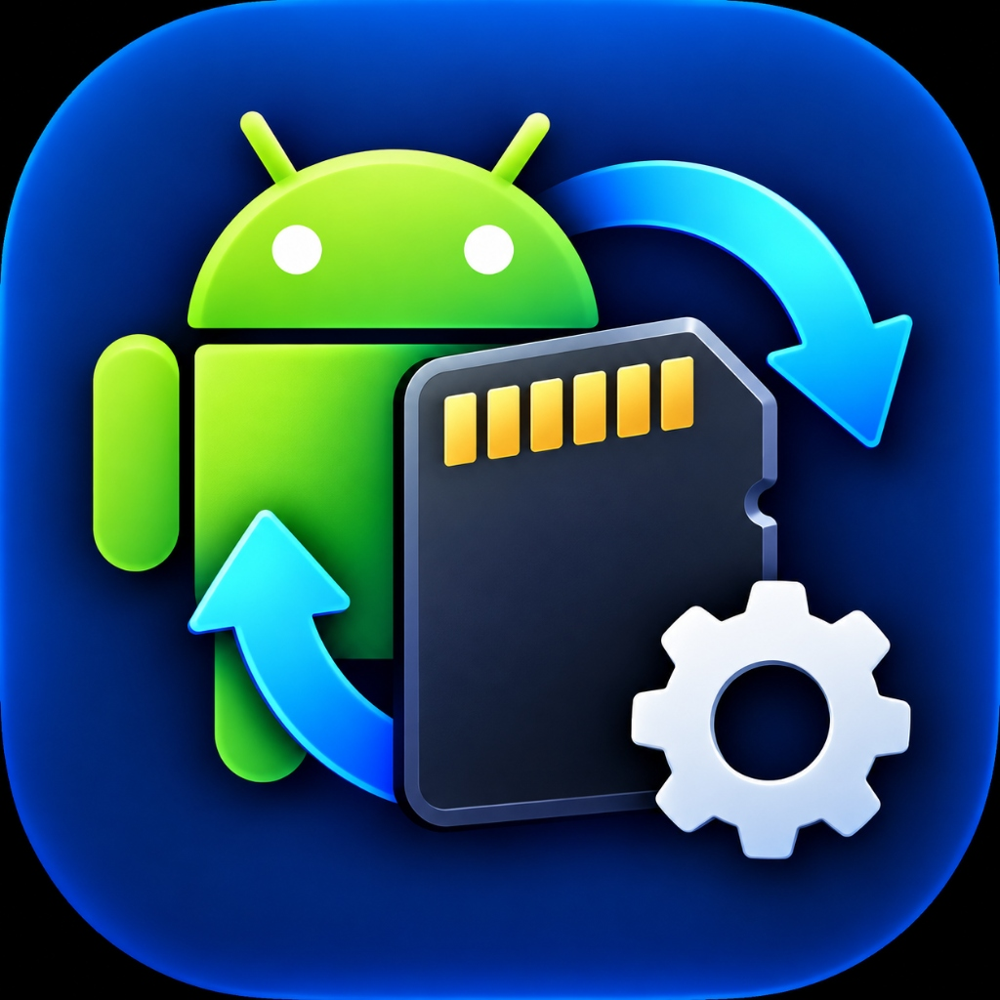

<div align="center">

  

  # ⚡ StoMount
  ### **Turn MicroSD Cards into Ultra-Fast Adopted Internal Android Storage**

  <p align="center">
    A modern, zero-dependency Windows desktop application that unleashes Android's hidden Adopted Storage capabilities over ADB with an intuitive 2-step setup wizard.
  </p>

  <!-- Badges -->
  <p align="center">
    <a href="#-downloads"></a>
    <a href="#-downloads"></a>
    
    
    
  </p>

  <p align="center">
    <a href="#-features">✨ Features</a> •
    <a href="#-downloads">📥 Downloads</a> •
    <a href="#-installation--setup">🚀 Installation</a> •
    <a href="#-how-to-use">📖 How to Use</a> •
    <a href="#-architecture--build">🛠️ Build from Source</a>
  </p>

  <!-- Animated typing effect banner -->
  <a href="https://github.com/ShelumHansana/StoMount">
    
  </a>

</div>

---

## 🌟 Why StoMount?

Android phones often run out of space while MicroSD cards sit mostly idle, restricted to simple media files. While Android natively supports **Adopted Storage** (combining your SD card with phone memory so apps can install directly on it), phone manufacturers hide or disable the menu option in their settings.

**StoMount breaks that limitation** by wrapping low-level Android Storage Manager (`sm`) and Package Manager (`pm`) ADB commands into a clean, safe, and intuitive Windows desktop application.

```
       📱 Your Android Phone                          💾 MicroSD Card
  ┌──────────────────────────────┐              ┌───────────────────────────┐
  │  Internal Storage (Full!)    │   StoMount   │  Adopted Storage          │
  │  [App 1] [App 2] [Photos]... ├─────────────►│  [App 1] [App 2] [Media]  │
  └──────────────────────────────┘   (via ADB)  └───────────────────────────┘
                                                ⚡ 100% Free Phone Memory!
```

---

## ✨ Features

<table>
  <tr>
    <td width="50%">
      <h3>💾 Step 1: 1-Click SD Adoption</h3>
      <ul>
        <li>Auto-detects inserted hardware SD card disks (<code>sm list-disks</code>).</li>
        <li>Prompts with strict two-factor safety protection (type <b>"YES"</b> + checkbox) to prevent accidental wipes.</li>
        <li>Formats and polls until the new private volume is mounted and ready.</li>
      </ul>
    </td>
    <td width="50%">
      <h3>🚀 Step 2: Batch App & Media Migration</h3>
      <ul>
        <li>Scans all installed 3rd-party packages (<code>pm list packages -3</code>).</li>
        <li>Batch migrates apps with a granular, real-time progress bar.</li>
        <li>Executes <code>pm move-primary-storage</code> to migrate photos, downloads, and shared storage.</li>
      </ul>
    </td>
  </tr>
  <tr>
    <td width="50%">
      <h3>🔄 Auto-Move Daemon</h3>
      <ul>
        <li>Background monitor checks every 20 seconds for newly installed apps.</li>
        <li>Automatically transfers new apps to your SD card without manual intervention.</li>
      </ul>
    </td>
    <td width="50%">
      <h3>📦 100% Zero-Setup & Portable</h3>
      <ul>
        <li><b>Official Google ADB is embedded directly inside the binary.</b></li>
        <li>No Android Studio, SDK downloads, or Python installation needed on target PCs.</li>
        <li>Includes a 1-click auto-downloader fallback if ADB is ever needed afresh.</li>
      </ul>
    </td>
  </tr>
  <tr>
    <td colspan="2">
      <h3>↩️ Storage Revert & Restore Wizard</h3>
      <ul>
        <li><b>1-Click Reset to Default Situation:</b> Reverts all 3rd-party apps back to phone internal memory (<code>pm move-package &lt;pkg&gt; internal</code>).</li>
        <li><b>Restore Primary Media:</b> Migrates photos, downloads, and shared storage back to phone memory (<code>pm move-primary-storage internal</code>).</li>
        <li><b>Convert SD Back to Portable:</b> Reformats the SD card back to standard portable storage (<code>sm partition public</code>) so it can be read on computers, cameras, and card readers again!</li>
      </ul>
    </td>
  </tr>
</table>

---

## 📥 Downloads

Choose the format that fits your needs:

| Package | Type | Description | Download |
|:---|:---:|:---|:---:|
| **`StoMount_Setup.exe`** | 💿 Windows Installer | Standard Windows Setup wizard with Desktop icon, Start Menu shortcut, and uninstaller. | [Download Setup](dist/StoMount_Setup.exe) |
| **`StoMount.exe`** | 📁 Portable Standalone | Single self-contained executable. Just double-click and run anywhere with zero installation. | [Download Portable](dist/StoMount.exe) |
| **`StoMount-v1.1-Windows.zip`** | 📦 Full Archive | Complete distribution bundle containing installer, portable `.exe`, and high-res icon assets. | [Download ZIP](dist/StoMount-v1.1-Windows.zip) |

---

## 🚀 Installation & Setup

### Using the Standard Windows Installer (`StoMount_Setup.exe`)
1. Download **`StoMount_Setup.exe`** from the table above.
2. Double-click the installer and follow the familiar Windows setup wizard:
   - Choose your install folder (defaults to `%LOCALAPPDATA%\Programs\StoMount`).
   - Check **Create a desktop shortcut**.
   - Click **Install** and **Finish**.
3. Launch StoMount from your Desktop or Start Menu.

> [!TIP]
> **No Administrator Rights Required!** The installer runs in user-space, making it safe and compatible with restricted work/school PCs.

---

## 📖 How to Use

Follow these 4 simple steps to expand your storage:

### Step 1: Enable USB Debugging on your Phone
1. Open phone **Settings** ➔ **About Phone**.
2. Tap **Build Number** 7 times until it says *"You are now a developer!"*.
3. Go to **Settings** ➔ **System** (or Additional Settings) ➔ **Developer Options**.
4. Enable **USB Debugging**.

### Step 2: Connect to PC
1. Connect your phone using a USB data cable.
2. When the popup appears on your phone screen, check **"Always allow from this computer"** and tap **Allow**.
3. In StoMount, the connection badge will turn green: `● Connected`.

### Step 3: Mount SD Card as Internal Storage (Step 1 Button)
> [!WARNING]
> **Backup Notice**: Formatting your SD card as internal storage will **permanently erase** any existing photos or files on the card. Back up important files to your computer first!

1. Click **⚡ Mount SD Card as Internal Storage**.
2. In the safety dialog, check the confirmation box and type **`YES`**.
3. StoMount will format the card and automatically extract its unique volume UUID.

### Step 4: Migrate Apps & Data (Step 2 Button)
1. Once Step 1 is finished, the **🚀 Move All Apps & Content to SD Card** button unlocks.
2. Click it to migrate all third-party apps and transfer primary storage.
3. Monitor progress in real time via the progress bar and ADB console log!

---

## 🖥️ User Interface Overview

<div align="center">

```
┌────────────────────────────────────────────────────────────────────────────────────────┐
│ ⚡ StoMount | Android Adopted Storage                     [📖 Guide] [⚙ ADB] [↻ Refresh] │
├────────────────────────────────────────────────────────────────────────────────────────┤
│ [● Connected]  Google Pixel 6 (FA7910300123)            [SD Card: disk:179,64]         │
├────────────────────────────────────────────────────────────────────────────────────────┤
│ Adopted SD Card UUID: [ 39a48915-0be1-4cf1-8314-3cdfb7199c04 ] [🔍 Detect] [💾 Save]    │
├────────────────────────────────────────────────────────────────────────────────────────┤
│ PRIMARY WORKFLOW:                                                                      │
│ ┌─────────────────────────────────────────┐  ┌───────────────────────────────────────┐ │
│ │ STEP 1          [✓ SD Card Adopted]     │  │ STEP 2             [Ready to Migrate] │ │
│ │ Mount SD as Internal Storage            │  │ Move All Apps & Content to SD         │ │
│ │ Formats microSD into adopted storage    │  │ Batch moves apps & primary media      │ │
│ │ [⚡ Mount SD Card as Internal Storage]  │  │ [🚀 Move All Apps & Content to SD]    │ │
│ └─────────────────────────────────────────┘  └───────────────────────────────────────┘ │
├────────────────────────────────────────────────────────────────────────────────────────┤
│ Additional Storage Controls:                                                           │
│ Move Single App: [Filter: whats...  ] [com.whatsapp        ▼] [↻ Refresh] [Move App]   │
│ [x] Auto-move newly installed apps to SD Card (scans every 20s)           [ON (Active)]│
├────────────────────────────────────────────────────────────────────────────────────────┤
│ Moving app 14 of 62: com.whatsapp                                                [45%] │
│ [█████████████████████████████████████░░░░░░░░░░░░░░░░░░░░░]                           │
├────────────────────────────────────────────────────────────────────────────────────────┤
│ ADB Command Log & Real-Time Console                           [📋 Copy All] [Clear Log]│
│ [11:45:01] [INFO] Connected to Google Pixel 6 (FA7910300123)                           │
│ [11:45:06] [SUCCESS] Partitioned disk:179,64 private                                   │
│ [11:45:16] [SUCCESS] Detected adopted volume UUID: 39a48915-0be1-4cf1-8314-3cdfb7199c04│
│ [11:45:20] [SUCCESS] ✓ com.whatsapp: Move succeeded!                                   │
└────────────────────────────────────────────────────────────────────────────────────────┘
```

</div>

---

## 🛠️ Build from Source

StoMount is built purely on Python's standard library. No `pip install` packages are required to run the script.

### Requirements
- Python 3.10+ on Windows 10 / 11
- PyInstaller (for compiling `.exe`)
- Inno Setup 6 (optional, for compiling `Setup.exe`)

### 1. Run from Python
```powershell
# Clone the repository
git clone https://github.com/ShelumHansana/StoMount.git
cd StoMount

# Run the app directly
python stomount.py
```

### 2. Compile Standalone `.exe`
```powershell
pip install pyinstaller

pyinstaller --noconfirm --onefile --windowed `
  --icon="app_icon.ico" `
  --add-data "app_icon.ico;." `
  --add-binary "platform-tools/*;platform-tools" `
  --name "StoMount" stomount.py
```

### 3. Compile Windows Setup Installer
```powershell
# Compile with Inno Setup Compiler
& "$env:LOCALAPPDATA\Programs\Inno Setup 6\ISCC.exe" "StoMount_Setup.iss"
```

---

## 📂 Project Structure

```
StoMount/
├── stomount.py             # Main application & ADB backend controller
├── app_icon.ico            # Multi-size Windows application icon (16x16 -> 256x256)
├── app_icon.png            # High-resolution 1024x1024 branding asset
├── StoMount_Setup.iss      # Inno Setup installation wizard configuration
├── Install-StoMount.bat    # Portable 1-click script installer
├── platform-tools/         # Bundled Google Android ADB binaries
│   ├── adb.exe
│   ├── AdbWinApi.dll
│   ├── AdbWinUsbApi.dll
│   └── libwinpthread-1.dll
└── dist/
    ├── StoMount_Setup.exe  # Standard Windows Setup Wizard (~20 MB)
    ├── StoMount.exe        # Portable single-file executable (~16 MB)
    └── StoMount-v1.1-Windows.zip # Complete distribution archive
```

---

## ❓ Troubleshooting

<details>
  <summary><b>Phone says "Unauthorized" in the top bar</b></summary>
  <br/>
  Look at your phone screen! Android displays a security dialogue asking to <i>"Allow USB debugging?"</i>. Check <b>"Always allow from this computer"</b> and tap <b>OK</b>. Click <b>↻ Refresh</b> in StoMount.
</details>

<details>
  <summary><b>No SD card disks detected in Step 1</b></summary>
  <br/>
  1. Verify the microSD card is formatted as FAT32/exFAT and properly inserted into your phone.<br/>
  2. On some OEM ROMs (e.g. older MIUI/EMUI), adopted storage is restricted in kernel. In Developer Options, enable <b>"Force allow apps on external"</b> and reboot.
</details>

<details>
  <summary><b>Some apps fail to move</b></summary>
  <br/>
  Certain apps (banking apps, authenticator apps, or system services) specify <code>android:installLocation="internalOnly"</code> in their AndroidManifest.xml. Android prevents these specific apps from moving to maintain security. StoMount will skip them gracefully and continue moving the rest of your apps.
</details>

---

## 📄 License

This project is licensed under the **MIT License** - see the [LICENSE](LICENSE) file for details.

---

<div align="center">
  <sub>Built with ❤️ for the Android & Windows community by <a href="https://github.com/ShelumHansana">Shelum Hansana</a>.</sub>
</div>
